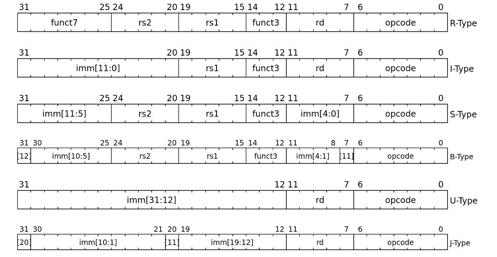
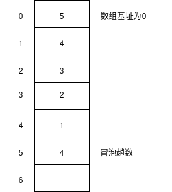

# riscv单周期cpu的实现

## 1. 指令集

1. 指令集类型



2. 选择实现的指令

   1. R-type

      add, sub, sll, xor, srl,  sra, or, and， slt, sltu

   2. I-type

      addi, slli, xori, srli, srai, ori, andi,			没有subi的原因是addi可以直接加负数

      lw,

      jalr

   3. S-type

      sw

   4. SB-type

      beq, bne, blt, bge, bltu, bgeu

   5. U-type

      lui

   6. UJ-type

      jal


## 2. ALU实现

| 操作 | 功能     | 描述             | 对应码值      |
| ---- | -------- | ---------------- | ------------- |
| add  | a + b    | a 加 b           | 000_0000_0001 |
| sub  | a - b    | a 减 b           | 000_0000_0010 |
| sll  | a sll b  | a 左移 b         | 000_0000_0100 |
| xor  | a ^ b    | a 异或 b         | 000_0000_1000 |
| srl  | a srl b  | a 逻辑右移 b     | 000_0001_0000 |
| sra  | a sra b  | a 算术右移 b     | 000_0010_0000 |
| or   | a \| b   | a 或 b           | 000_0100_0000 |
| and  | a & b    | a 与 b           | 000_1000_0000 |
| slt  | a slt b  | a 小于 b         | 001_0000_0000 |
| sltu | a sltu b | a 小于 b(无符号) | 010_0000_0000 |
| lui  | lui b    | b 高位加载       | 100_0000_0000 |

* 对应码值由ALU_control实现，利用ALU_control可以将指令类型的判断隔离出ALU模块，使得ALU模块只关注计算的实现
* 这里对应的码值采用了one-hot的形式，原因是个人觉得比较简单直观，且当这些操作都不执行时，one-hot可以为其默认赋值为0,当然，码值的定义也可以采用4位的方式，但是会有4个数没有用到，为了不出现令人疑惑的行为，最好将这四个数出现的情况赋值为0


## 3. Comp实现

比较器其实是用来实现分支跳转指令的，至于为什么不复用ALU的实现，在学习到流水线就会知道.

比较器的逻辑采用的是将两数相减，通过zero, cout, sign的值来判断相等，小于，大于等于


## 4. 存储设备的实现

1. 寄存器堆，riscv一共有32个寄存器，其中0号寄存器的值恒为0

2. 指令ram和数据ram的实现，ram一共有两种方式，同步ram和异步ram，下面简要介绍同步ram和异步ram

   * 同步ram: 第一拍发送读请求和读地址，第二拍ram才会输出读数据。
   * 异步ram: 当拍给地址，当拍出数据，写操作与同步ram相同

   可以看出，除非不实现load指令，否则同步ram不可能用来实现单周期cpu。

3. 思考:在异步ram中，读写地址相同时怎么办？一般ram的内置逻辑是先读后写。


## 5. 控制信号生成

根据画出的电路图，需要控制模块生成的信号有

1. 决定下一条指令地址的4选1（one-hot), 有branch_control决定

2. 决定ALU操作（10 one-hot),有ALU——control决定

3. 给出指令类型，8种指令，采用one-hot 编码,对应表格为

   | opcode   | 指令   | 码值      |
   | -------- | ------ | --------- |
   | 011_0011 | Rtype  | 0000_0001 |
   | 001_0011 | Itype  | 0000_0010 |
   | 000_0011 | lw     | 0000_0100 |
   | 010_0011 | sw     | 0000_1000 |
   | 110_0011 | B-type | 0001_0000 |
   | 110_0111 | jalr   | 0010_0000 |
   | 110_1111 | jal    | 0100_0000 |
   | 011_0111 | lui    | 1000_0000 |

4. data_ram是否write: 只有sw指令这一种情况

5. RegWrite: 除sw指令，B-type指令意外的所有指令

6. SRC2(4 one-hot) : sw, Itype, lui, Rtype

7. MemtoReg(3 one hot): jal/jalr,sw,除B-type外所有，所以信号定义如下

   | opcode   | 指令类型 | 类型编码  | ALUContrl | BranchControl | MemWrite | RegWrite | AluSrc | MemtoReg |
   | -------- | -------- | --------- | --------- | ------------- | -------- | -------- | ------ | -------- |
   | 011_0011 | Rtype    | 0000_0001 | 00001     | 000           | 0        | 1        | 0001   | 001      |
   | 001_0011 | Itype    | 0000_0010 | 00010     | 000           | 0        | 1        | 0010   | 001      |
   | 000_0011 | lw       | 0000_0100 | 00100     | 000           | 0        | 1        | 0010   | 010      |
   | 010_0011 | sw       | 0000_1000 | 01000     | 000           | 1        | 0        | 0100   | 000      |
   | 110_0011 | B-type   | 0001_0000 | 00000     | 001           | 0        | 0        | 0000   | 000      |
   | 110_0111 | jalr     | 0010_0000 | 00000     | 010           | 0        | 1        | 0000   | 100      |
   | 110_1111 | jal      | 0100_0000 | 00000     | 100           | 0        | 1        | 0000   | 100      |
   | 011_0111 | lui      | 1000_0000 | 10000     | 000           | 0        | 1        | 1000   | 001      |

   


branch_control：

输入为func3, branch_control

1. 需要内置比较器

2. 输入为data1,data2,8bit one-hot

3. 输出为3bit one-hot

4. 对应表格为

   | 指令   | 码值 |
   | ------ | ---- |
   | PC + 4 | 0001 |
   | Btype  | 0010 |
   | jal    | 0100 |
   | jalr   | 1000 |


ALU_control

输入指令类型, fun3, instr[30], 输出操作，采用one-hot编码

| 指令类型              | func             | instr[30] | 操作 | 输出码值      |
| --------------------- | ---------------- | --------- | ---- | ------------- |
| R/I_type_add,  lw, sw | 000(R/I,010(l/s) | 0/na      | add  | 000_0000_0001 |
| R_type_sub            | 000              | 1         | sub  | 000_0000_0010 |
| R/I_type_sll          | 001              | 0         | sll  | 000_0000_0100 |
| R/I_type_xor          | 100              | 0/na      | xor  | 000_0000_1000 |
| R/I_type_srl          | 101              | 0         | srl  | 000_0001_0000 |
| R/I_type_sra          | 101              | 1         | sra  | 000_0010_0000 |
| R/I_type_or           | 110              | 0/na      | or   | 000_0100_0000 |
| R/I_type_and          | 111              | 0         | and  | 000_1000_0000 |
| R/I_type_slt          | 010              | 0         | slt  | 001_0000_0000 |
| R/I_type_sltu         | 011              | 0         | sltu | 010_0000_0000 |
| R/I_type_lui          | na               | na        | lui  | 100_0000_0000 |


## 6. 最后只需要按照图例搭建即可


## 7. 测试

这里采用coe文件测试，选用lw， sw， add指令测试， 编写riscv汇编指令并将其转化为01代码, 指令ram的coe文件如下图所示

```asm
lw r1, 0(r0)					// 加载0地址数据到r1
lw r2, 1(r0)					// 加载1地址数据到r2
add r3, r1, r2					// r1+r2并将结果写入r3
sw 2(r0), r3					// 将r3的指令存入2地址
lw r4, 2(r0)					// 将2地址数据加载到r4，实际是为了查看2地址数据是否写
```

<font color='red'>注意:</font>coe文件内容，即使汇编代码更改了内容，也不会显示，所以需要最后一条汇编语言来测试


第二个测试采用冒泡排序，将会使用多条语句,data_ram的结构图如下（模仿执行栈）



```asm
1.  lw   r1, 5(r0)			// r1 存储冒泡趟数
2.  bge  r1, r2	 20			// i 存在 r2, i >= 4? 若是，跳转
3.  sub  r3, r3, r3         // is_swap 存在 r3, 每次循环开始前置0
4.  subu  4, r2, r4			// i-4 存在 r4
5.  sub  r5, r5, r5			// j 存在 r5,每轮开始时j为0
6.  sub  r4, r0, r4			// r4 取反，即 i-4存在r4
7.  bge  r4, r5，18	 	   // j >= 4-i? 大于跳转
8.  load r6, 0(r5)			// 取a[j]到r6
9.  load r7, 1(r5)			// 取a[j+1]到r7
10. blt  r7, r6, 16			// a[j] < a[j+1], 若大于则跳转
11. add  r0, r6, r8			// r8作为中间寄存器存储a[j]的值
12. add  r7, r0, r6			// 更新a[j]的值为a[j+1]
13. add  r8, r0, r7			// 更新a[j+1]的值为a[j]
14. sw	 0(r5), r6			// 写回值a[j]
15. sw   1(r5), r7			// 写会值a[j+1]
16. addi  1, r0, r3			// is_swap置1
17. addi  1, r5, r5			// j++
17. jal  7					// 返回第二个循环处
18. addi  1, r2, r2			// i++
19. bgeu r5, 1,  2			//比较is_swap是否为1,为1跳回
20. end
//  测试开始
21. lw r1, 0(r0)
22. lw r1, 1(r0)
23. lw r1, 2(r0)
24. lw r1, 3(r0)
25. lw r1, 4(r0)
// 结果应为 1, 2, 3, 4, 5
```

鉴于手写汇编代码且转换为机器代码的复杂性，实现一个简易的riscv编译器是必要的，这样也可以增加测试用例来验证芯片
