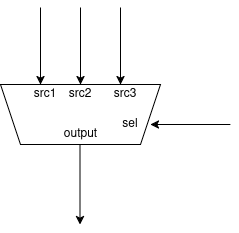
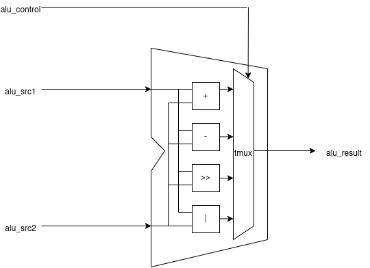
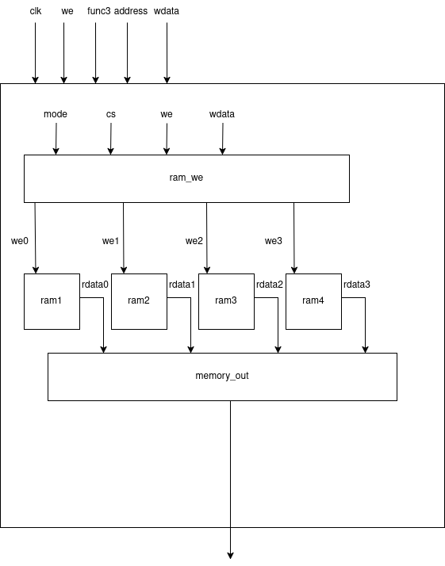
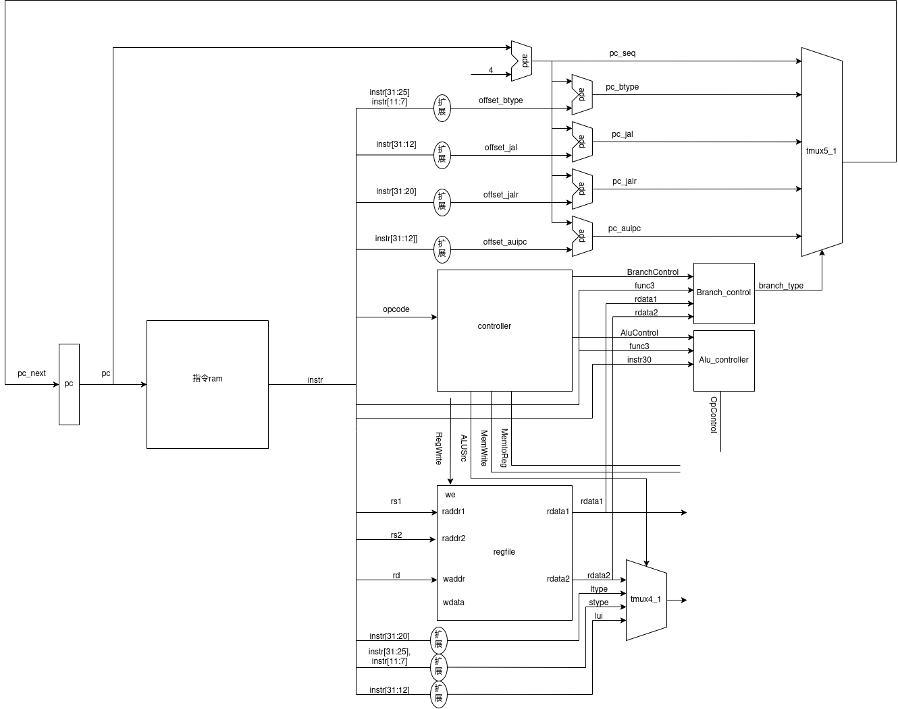
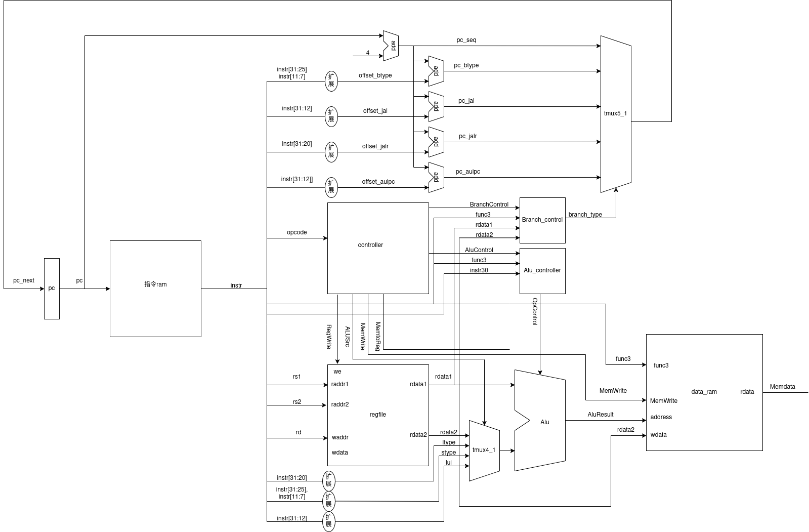

# 单周期CPU实现思路

## 实验环境

开发环境: `vivado 2023.2`

指令集: `RISCV`


## 基本部件

### 多路选择器



作用:根据`sel`的值，从所有的输入中选择一个作为输出数据

实现思路:

1. 采用case语句（不推荐，不够直观，建议组合逻辑电路，尽量全用assign语句表示）

2. ```verilog
   assign out = (sel == 2'b00) src1:
   			 (sel == 2'b01) src2:
   			 (sel == 2'b10) src3:
   			 				   0;
   ```

   引入了不必要的优先级关系，但是`sel`数据位数可以节省，不过可能会有冗余情况，故需要特别指出，当 `sel`没有包含全部情况时，输出`0`

3. ```verilog
   assign out = ({32{sel[0]}} & src1)
   		   | ({32{sel[1]}} & src2)
   		   | ({32{sel[2]}} & src3);
   ```

   这里，假定`sel`数据采用的是`one-hot`的编码方式，这种写法消除了方法2中的不必要的优先级关系，且没有冗余情况，即`sel`的唯一例外情况为全0,此时，`out`的输出为0


### 编码器和译码器

在我的单周期CPU的实现中，我并没有明确的使用译码器和编码器，我也不知道用译码器和编码器的好处，所以这一部分暂时跳过


### ALU

作用: `cpu`的运算不见，用来执行`cpu`的运算并由控制信号确定最终实现的结果

\

如示意图所示，实际上，`alu`是在内部，由各路计算单元先将需要计算的结果算出来以后，再通过多路选择器，由`alu_control`信号选择输出的数据

下面来看`RISCV`需要实现的基础计算功能，`RISCV`中`ALU`主要实现的功能为: `add`,`sub`,`sll`,`slt`,`sltu`,`xor`,`srl`,`sra`,`or`,`and`,`lui`

我们仍假定`alu_control`的控制信号采用的是`one-hot`类型编码，接下来看代码部分

```verilog
wire op_add;
wire op_sub;
wire op_sll;
wire op_xor;
wire op_srl;
wire op_sra;
wire op_or ;
wire op_and;
wire op_slt;
wire op_sltu;
wire op_lui;

assign op_add  = sel[ 0];
assign op_sub  = sel[ 1];
assign op_sll  = sel[ 2];
assign op_xor  = sel[ 3];
assign op_srl  = sel[ 4];
assign op_sra  = sel[ 5];
assign op_or   = sel[ 6];
assign op_and  = sel[ 7];
assign op_slt  = sel[ 8];
assign op_sltu = sel[ 9];
assign op_lui  = sel[10];
```

这部分代码为信号定义，更方便使用和理解，也方便后续的代码修改

```verilog
// add and sub
assign adder_src1 = src1;
assign adder_src2 = (op_sub | op_slt | op_sltu) ? ~src2 : src2;
assign adder_cin  = (op_sub | op_slt | op_sltu) ?  1'b1 : 1'b0;
assign {adder_cout, adder_result} = adder_src1 + adder_src2 +adder_cin;
assign add_sub_result = adder_result;

// compare
assign slt_result[31:1] = 31'b0;
assign slt_result[0]    = (src1[31] & ~src2[31])
                        | (~(src1[31] ^ src2[31])) & adder_result[31];

assign sltu_result[31:1] = 31'b0;
assign sltu_result[0]    = ~adder_cout;


// shift
wire [31:0] sll_result;
wire [31:0] srl_result;
wire [31:0] sra_result;

assign sll_result = src1 << src2[4:0];
assign srl_result = src1 >> src2[4:0];
assign sra_result = ($signed(src1)) >>> src2[4:0];

// others
wire [31:0] xor_result;
wire [31:0] or_result;
wire [31:0] and_result;
wire [31:0] lui_result;

assign xor_result = src1 ^ src2;
assign or_result  = src1 | src2;
assign and_result = src1 & src2;
assign lui_result = {src2[19:0], 12'b0};
```

这部分实现的是`ALU`内部的计算逻辑

```verilog
assign result = ({32{op_add | op_sub}} & add_sub_result)
              | ({32{op_sll         }} & sll_result)
              | ({32{op_xor         }} & xor_result)
              | ({32{op_srl         }} & srl_result)
              | ({32{op_sra         }} & sra_result)
              | ({32{op_or          }} &  or_result)
              | ({32{op_and         }} & and_result)
              | ({32{op_slt         }} & slt_result)
              | ({32{op_sltu        }} & sltu_result)
              | ({32{op_lui         }} & lui_result);
endmodule
```

这部分实际上是一个多路选择器，用来通过`alu_control`信号，将计算结果输出。


### 寄存器堆

作用: `RISCV`共有32个寄存器，其中，0号寄存器的值一直为0,可以利用0号寄存器实现取反等操作。具体实现

```verilog
always @(posedge clk) begin
    if (we) reg_array[waddr] <= wdata;
end

//read here register 0 is always 0
assign rdata1 = (raddr1 == 5'b0) ? 32'b0 : reg_array[raddr1];
assign rdata2 = (raddr2 == 5'b0) ? 32'b0 : reg_array[raddr2]; 
```

每一次读0号寄存器时，读出的数据都是0.


### 存储器

作用: 存储器是用来存储指令和数据的，异步存储器，在一个周期内即可读出数据（同步存储器需要两个周期，第一个周期送读地址，第二个周期读出数据），所以单周期的`cpu`采用异步存储器来解决。

在使用`vivado`提供的`ip`核时,数据是直接一个地址存储32位数据，与实际中学到的一个地址存储8位数据不符合，所以采用位扩展的方法（用4个8位的存储器来实现32位的存储器），来实现存储器。



ram_we模块: 负责处理写入数据

memory_out模块: 负责处理输出数据

这里，我们假设数据存储是边界对齐的，会简化一些存储器的逻辑


#### ram_we实现

1. 类型定义

   ```verilog
   wire wdata32;
   wire wdata16;
   wire wdata8;
   
   assign wdata32 = mode[2];
   assign wdata16 = mode[1];
   assign wdata8  = mode[0];
   ```

2. 写数据处理

   ```verilog
   assign wdata_8 = ({32{(cs == 2'b00)}} & {24'b0, wdata_in[7:0]})
                  | ({32{(cs == 2'b01)}} & {16'b0, wdata_in[7:0],  8'b0})
                  | ({32{(cs == 2'b10)}} & { 8'b0, wdata_in[7:0], 16'b0})
                  | ({32{(cs == 2'b11)}} & {wdata_in[7:0], 24'b0});
   
   assign wdata_16 = ({32{(cs == 2'b00)}} & {16'b0, wdata_in[15:0]})
                   | ({32{(cs == 2'b10)}} & {wdata_in[15:0], 16'b0});
   
   assign wdata_32 = wdata_in;  
   ```

   对写数据进行处理，根据片选信号来移动写入数据。

   这里说明一下，为什么要对数据进行移位处理，以8位数据为例子，因为寄存器为32位的，，所以传入时要写入的数据在最后8位。而地址的最后两位是片选信号，所以需要根据这个选择将数据移到哪个位置的`ram`,并把`ram`对应的`we`信号写入。

3. 写信号生成

   ```verilog
   assign we3 = (wdata32
              | ((cs == 2'b10) & wdata16)
              | ((cs == 2'b11) & wdata8))
              & we;
   
   assign we2 = (wdata32
              | ((cs == 2'b10) & wdata16)
              | ((cs == 2'b10) & wdata8))
              & we;
   
   assign we1 = (wdata32
              | ((cs == 2'b00) & wdata16)
              | ((cs == 2'b01) & wdata8))
              & we;
   
   assign we0 = (wdata32
              | ((cs == 2'b00) & wdata16)
              | ((cs == 2'b00) & wdata8))
              & we;       
   ```

   根据片选信号和类型（8位，16位，32位）生成相应ram的写信号.

4. 写数据生成

   ```verilog
   tmux3_1 wdata_sel(
       .src1  (wdata_8  ),
       .src2  (wdata_16 ),
       .src3  (wdata_32 ),
       .sel   (mode     ),
       .result(wdata    )
   );
   ```

   根据类型，选择修改后的写数据。


#### memory_out模块

1. 组合数据

   ```verilog
   assign data8 = ({8{(cs == 2'b00)}} & data_0)
                | ({8{(cs == 2'b01)}} & data_1)
                | ({8{(cs == 2'b10)}} & data_2)
                | ({8{(cs == 2'b11)}} & data_3);
   
   assign data16 = ({16{cs == 2'b00}} & {data_1, data_0})
                 | ({16{cs == 2'b10}} & {data_3, data_2});
   
   assign data32 = {data_3, data_2, data_1, data_0};
   ```

2. 对8位数据和16位数据根据`uint`信号选择0扩展还是位扩展

   ```verilog
   assign data8_zero = {{24{1'b0}}, data8};
   assign data8_sign = {{24{data8[7]}}, data8};
   assign data16_zero = {{16{1'b0}}, data16};
   assign data16_sign = {{16{data16[15]}}, data16};
   
   assign data8_sel = ({32{uint }} & data8_zero)
                    | ({32{~uint}} & data8_sign);
   
   assign data16_sel = ({32{uint }} & data16_zero)
                     | ({32{~uint}} & data16_sign);
   ```

3. 通过3选1选择器，根据类型选择读出数据

   ```verilog
   tmux3_1 mem_out(
       .src1  (data8_sel),
       .src2  (data16_sel),
       .src3  (data32),
       .sel   (mode),
       .result(data)
   );
   ```


## 实现步骤

### IF


IF阶段主要是根据pc的值来取出指令ram中的指令。


### ID



ID可以说是重中之重，这里我们分成三部分来看

#### 控制器部分

1. controller

   这里根据`opcode`信号可以判断指令的类型，进而产生相应的控制信号，控制信号功能如下表所示

   | 信号            | 作用                               |
   | --------------- | ---------------------------------- |
   | `BranchControl` | 用来使分支控制器产生相应的控制信号 |
   | `AluControl`    | 用来使`Alu`控制器产生操作信号      |
   | `RegWrite`      | 控制寄存器读                       |
   | `ALUSrc`        | 控制选择`ALU`的原操作数2           |
   | `MemWrite`      | 控制数据存储器写                   |
   | `MemtoReg`      | 选择写回内存的值                   |

   这里对`ALUSrc`信号和`MemtoReg`信号进行解释：

   `ALUSrc`:因为`RISCV`指令中，有`Rtype`，`Itype`，`Stype`以及`lui`指令，这些指令在本设计中复用一个`ALU`,而这四个指令的第二个原操作数的获取方式是不同的。`Rtype`从寄存器堆获取，`Itype`,`Stype`,`lui`则是将指令中部分立即数经过位扩展后得到，故需要该信号来选择`ALU`的原操作数2.

   `MemtoReg`:需要将数据写回到寄存器堆的指令有`Rtype`,`jal`,`jalr`,`Stype`,`auipc`，写回的数据如下

   | 类型         | 写回数据         |
   | ------------ | ---------------- |
   | `Rtype`      | `ALU`的计算结果  |
   | `jal`,`jalr` | `pc+4`           |
   | `Stype`      | 从内存提取的结果 |
   | `auipc`      | 分支地址         |

   故需要多路选择器选择写会哪个数据

2. Alu_controller

   根据`AluControl`,`func3`,指令的次高位来确定`Opcontrol`信号（控制`Alu`执行)

3. Branch_control

   根据`BranchControl`,`func3`,从寄存器读出的数据来判断分支地址应该是哪种，生成`branch_type`信号来控制下一条指令地址。


#### 寄存器堆部分

根据`rs1`,`rs2`读出数据，并利用多路选择器选择原操作数2,`rd`为写寄存器地址.


#### 分支计算部分

计算出分支和顺序执行的地址，并利用多路选择器选择下一条指令地址。


### EX


这一部分其实就是将`rdata1`和原操作数2输入`ALU`，然后根据`OpControl`信号产生`Alu`的计算结果。


### MEM



`MEM`即访存，`RISCV`只有两种指令可以访存，即`load`指令和`store`指令,在基础部件部分我们已经提到，将`data ram`进行了位扩展,所以需要`func3`信号充当类型，指导内存读入/取出的数据是32位/16位/8位的。这里若是`store`指令，即有数据写入，写入的为从寄存器中读取的`rdata2`,`ALU`的计算结果可以作为读地址，也可以作为写地址，是否读写由`MemWrite`信号指示。


##### WB


`wb`即写会，只需要在4选1选择器中选择一个数作为寄存器堆的写入数据即可。三